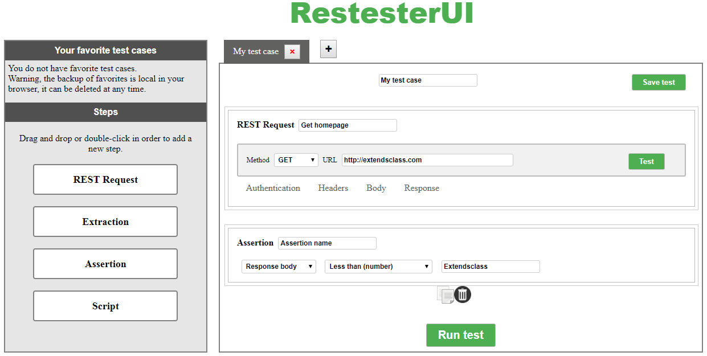

# RestesterUI

RestesterUI is a web-based web service testing tool written in JavaScript.
It allows to make test cases in order to validate APIs.

This tool is still basic and needs to be improved.

Try the demo here: [https://extendsclass.com/web-service-tester.html](https://extendsclass.com/web-service-tester.html)



# Features

List of widgets that can be added in a test case:

 * Make an HTTP request
The "REST request" widget allows to make an HTTP request (For SOAP or REST API).

 * Extract data from the HTTP response:
The "Extraction" widget allows to extract data from header or body of the HTTP response.
It is possible to use XPath, Regex, css selector or JSONPath to retrieve data from the response.

 * Assert the responses of the HTTP response::
The "Assertion" widget is used to check the responses.

 * Execute JavaScript code:
The "Script" widget is used to execute JavaScript code.

It is possible to easily configure complex test cases.

## Dependencies 

This tool required:
 * [CodeMirror](https://github.com/codemirror/CodeMirror) (MIT license)
 * [JSONPath Plus](http://travis-ci.org/s3u/JSONPath) (MIT license)
 
## Install

Drop the files into a directory (on a server or on your PC) and then visit in a browser. 

## Launch tests

Update config.js file with the path of your installation.

You must install packages:
```shell
npm install
```

Finally, runs the tests:
```shell
npm run test
```

## License

MIT
